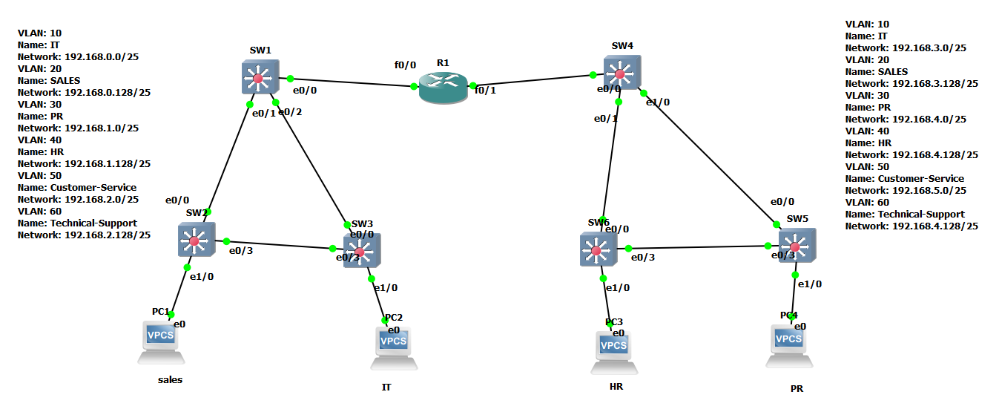

# Multi-Site Enterprise Network Lab
Enterprise Network Lab using VLANs, VTP, Trunking, Inter-VLAN Routing and DHCP
# Multi-Site Enterprise Network Lab

## Project Overview

This project simulates a multi-site enterprise network infrastructure using Cisco technologies in GNS3.

The lab demonstrates VLAN segmentation, VTP domain management, DHCP services, IEEE 802.1Q trunking, and Inter-VLAN Routing using Router-on-a-Stick architecture.

---

## Network Topology

---

## Network Design

### Site A

| VLAN | Department | Network |
|--------|--------|--------|
| 10 | IT | 192.168.0.0/25 |
| 20 | Sales | 192.168.0.128/25 |
| 30 | PR | 192.168.1.0/25 |
| 40 | HR | 192.168.1.128/25 |
| 50 | Customer-Service | 192.168.2.0/25 |
| 60 | Technical-Support | 192.168.2.128/25 |

### Site B

| VLAN | Department | Network |
|--------|--------|--------|
| 10 | IT | 192.168.3.0/25 |
| 20 | Sales | 192.168.3.128/25 |
| 30 | PR | 192.168.4.0/25 |
| 40 | HR | 192.168.4.128/25 |
| 50 | Customer-Service | 192.168.5.0/25 |
| 60 | Technical-Support | 192.168.5.128/25 |

---

## Technologies Implemented

- VLAN Configuration
- VTP Server / Client
- IEEE 802.1Q Trunking
- Router-on-a-Stick
- Inter-VLAN Routing
- DHCP Pools
- Cisco IOS
- GNS3 Network Simulation

---

## Devices

- 1 Cisco Router
- 6 Cisco Switches
- 4 End Devices (VPCS)

---

## Verification Performed

- VLAN Verification
- VTP Synchronization Verification
- Trunk Verification
- DHCP Lease Verification
- Connectivity Testing
- Inter-VLAN Communication Testing

---

## Repository Structure

configs/
Verification/
Images/

---

## Author

Mohamed Mahmoud Elkholy
